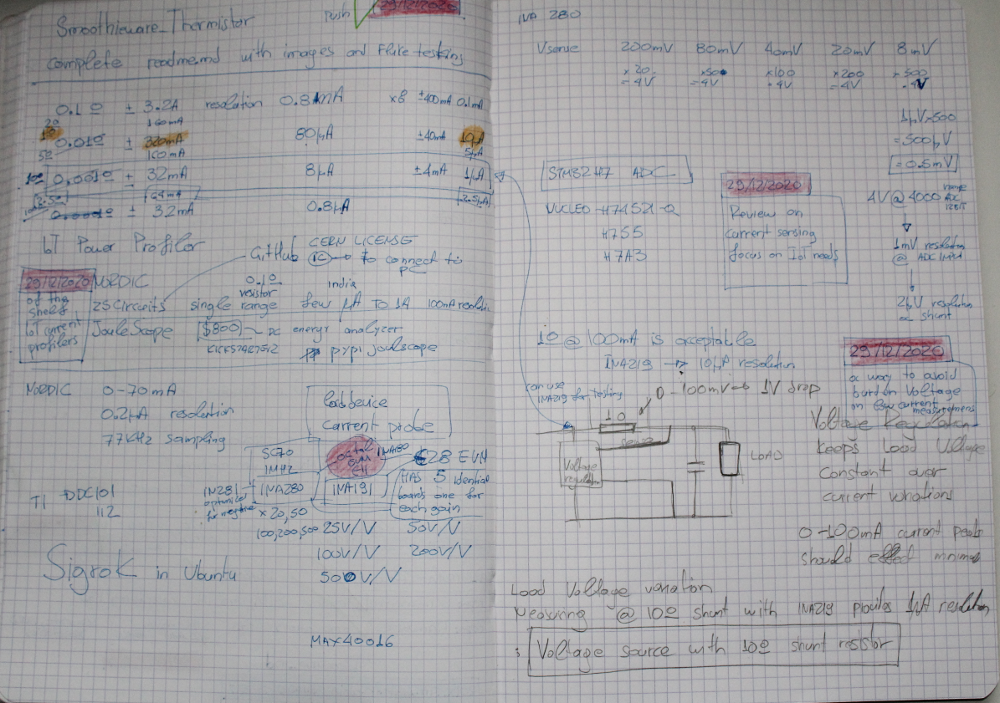

# IoT_Power_Profiler

## Of the Shelf
 *  Review for of the shelf Iot Power Profilers
   *  QOITECH
   *  ZScircuits: Export to Sigrok
   *  JouleScope
   *  Nordic

## TI current Sensors
 *  INA219 Digital 10μV @ 10 Ω shunt
 *  INA191
 *  INA280 SC70 1MHz

## INA280 range example
x500 --> 2μV @ shunt

## Simple Voltage Regulator solution
A way to avoid the Burden Voltage issue @ 10 Ω shunt 

## Notes

 