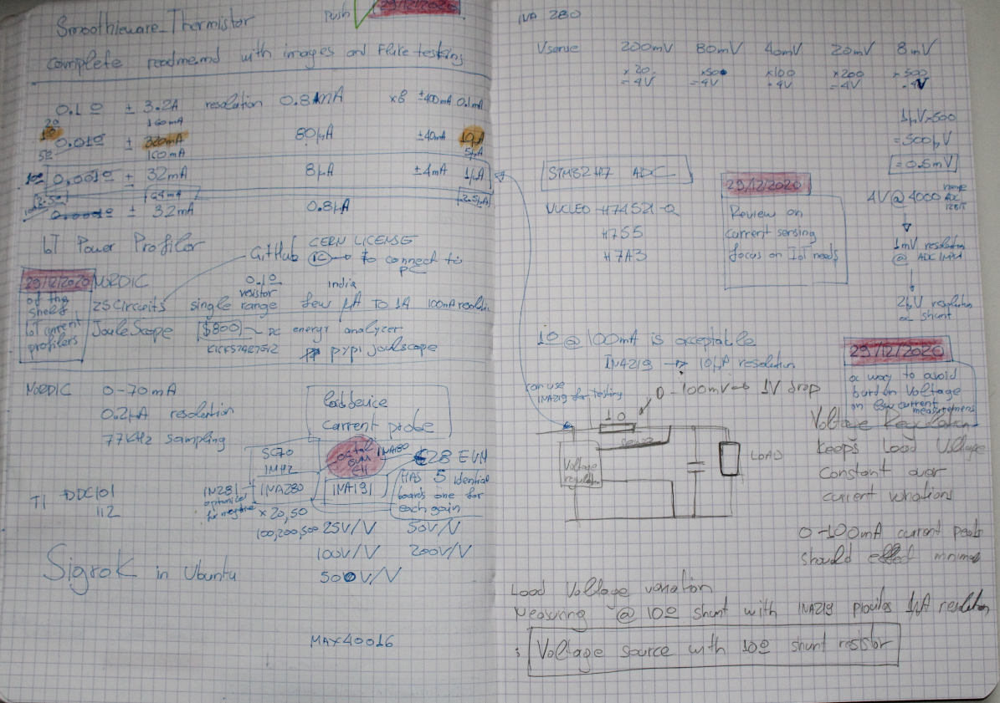
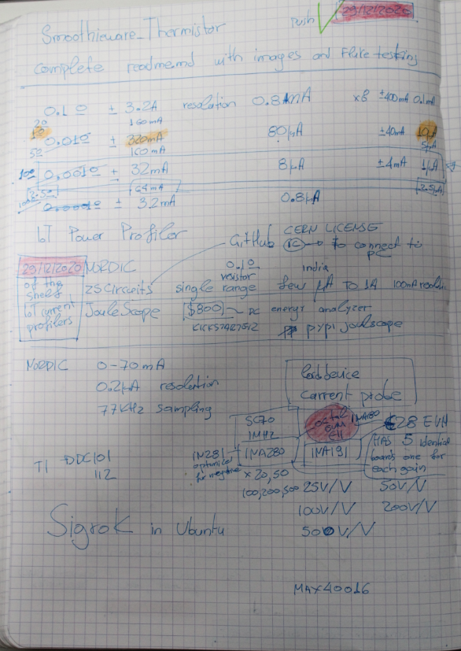
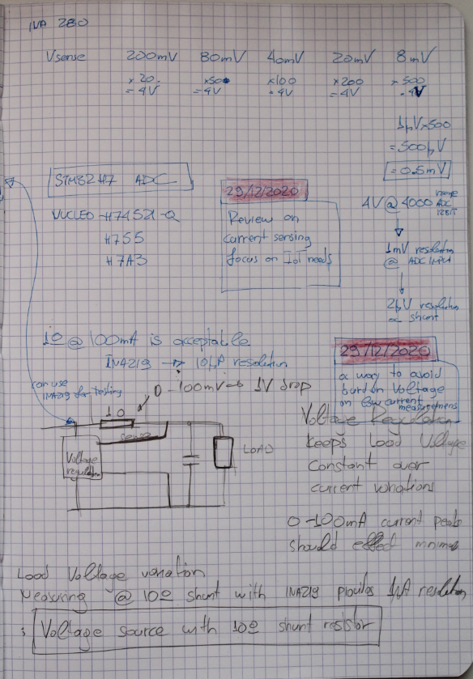

# IoT_Power_Profiler

## Of the Shelf
 *  Review for of the shelf Iot Power Profilers
   *  QOITECH :5 KHz Bandwidth, expensive Software
   *  ZScircuits: Export to Sigrok, Kickstarter
   *  JouleScope
   *  Nordic
   *  SiLabs EFM32 Zero Gecko Starter Kit w/ Sensor Card

## TI current Sensors
 *  INA219 Digital 10μV @ 10 Ω shunt
 *  INA191
 *  INA280 SC70 1MHz

## INA280 range example
x500 --> 2μV @ shunt
 *  SC70
 *  1.1 MHz
 *  Constant Gain: 20, 50,100, 200, 500

## AD8428 Low Noise, Low Gain Drift, G = 2000 Instrumentation Amplifier
x2000 --> 0.5μV @ shunt
 *  $20
 *  3.5 MHz

## Simple Voltage Regulator solution
A way to avoid the Burden Voltage issue @ 10 Ω shunt 

## Notes

 

## Links
 *  https://www.eevblog.com/forum/testgear/measuring-current-on-a-low-power-iot-device/25/
 *  https://www.element14.com/community/roadTestReviews/1918
 *  https://www.ti.com/lit/ds/symlink/lp3982.pdf?ts=1609503972847&ref_url=https%253A%252F%252Fwww.google.com%252F
 *  https://www.analog.com/media/en/technical-documentation/data-sheets/6102fe.pdf
 *  https://www.analog.com/media/en/technical-documentation/data-sheets/AD8655_8656.pdf
 *  https://dorkbotpdx.org/blog/paul/measuring_microamps_milliamps_at_3_mhz_bandwidth/
 *  https://www.analog.com/media/en/technical-documentation/data-sheets/AD8428.PDF

